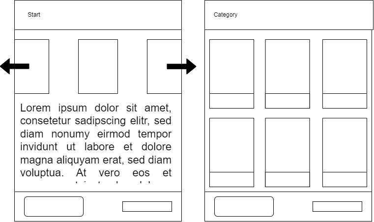

# Steem

Mein Ziel ist es ein Onlineshop für Videospiele zu erstellen. 

Als Vorlage habe ich mir die Seite von Steam genommen.

Ich will aber **nicht** Steam kopieren, da ich diese Seite sehr unübersichtlich finde.
Ich will nur einige grundlegende Funktionalitäten übernehmen und den Rest selbst erstellen.

## Seiten
1. Startseite
2. Produktseite

## Styleguide
Den Styleguide findet man [hier](./styleguide.md)

