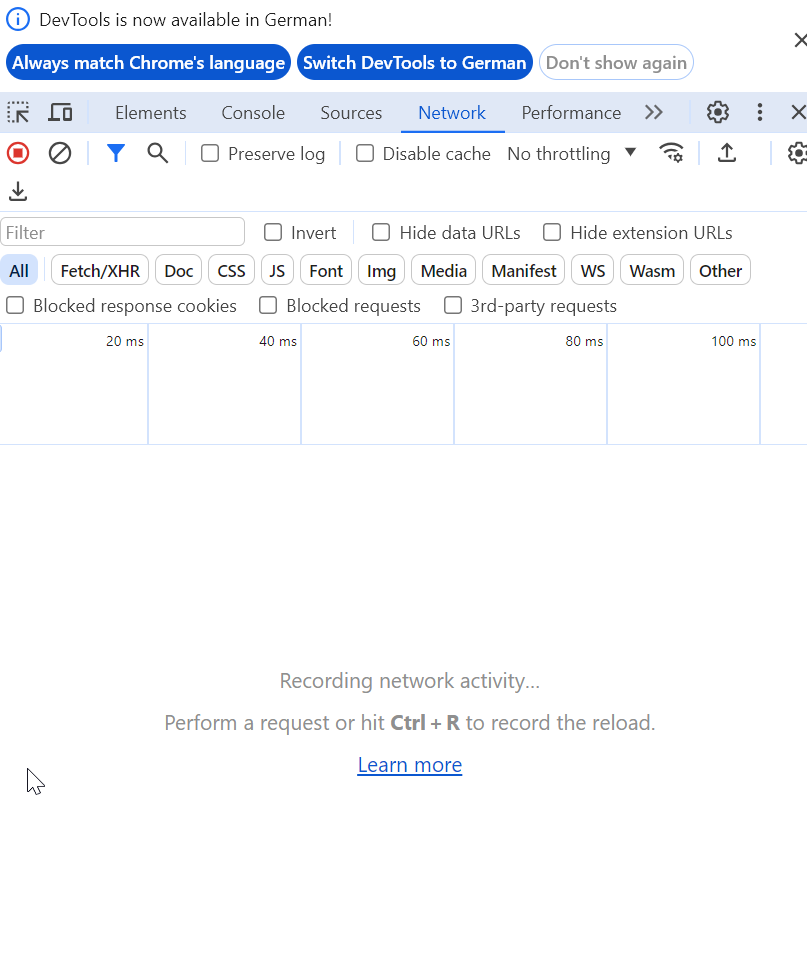
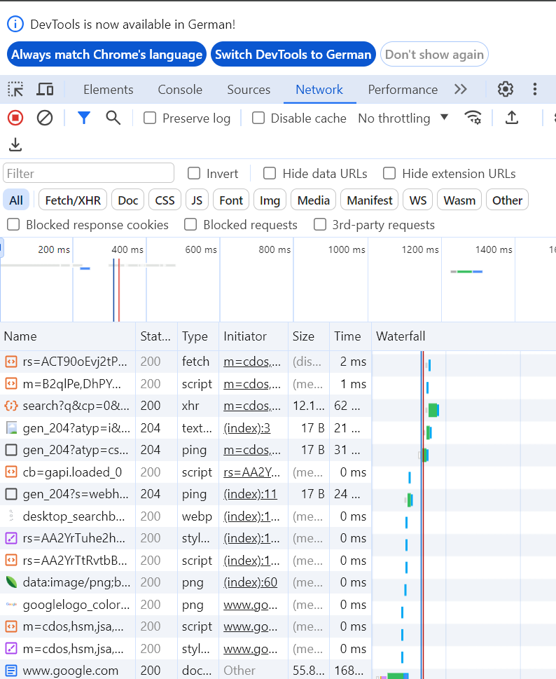

# Übung 1

1. [Google](https://www.google.com/)
2. f12
3. Man sieht noch nichts 
4. ctrl + r
5. Man sieht die verschiedenen Requests 
6. ctrl + l

# Übung 2

1. [NZZ](https://nzz.ch/)
2. Wenn man auf der Startseite von einem Bild aus in die DevTools geht, dann kommt man nicht zum Artikel selbst, sondern
   zum Link der dich zum Artikel bringt.
3. In einem Artikel selbst kann man das auch machen, dann kommt man auf den Text des Artikels.